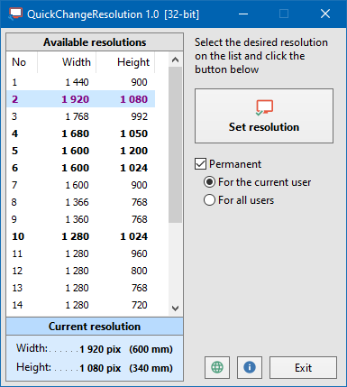

# QuickChangeResolution

* [QuickChangeResolution](#quickchangeresolution)
  * [Overview](#overview)
  * [Screenshot](#screenshot)
  * [Download](#download)
  * [Run-time parameters](#run-time-parameters)
  * [License](#license)
  * [Note](#note)
  * [Compilation](#compilation)
  * [Releases](#releases)

## Overview

**QuickChangeResolution** is a small utility that allows you to quickly change the display resolution.

## Screenshot

## Download

Source: <https://github.com/jackdp/Quick-Change-Resolution>  
Compiled binaries (Windows 32 and 64-bit): <https://www.pazera-software.com/products/quick-change-resolution/>

## Run-time parameters

|        Parameter         |                                                 Description                                                  |
| ------------------------ | ------------------------------------------------------------------------------------------------------------ |
| `-r`, `--set-resolution` | Sets the given resolution.                                                                                   |
| `-u`, `--user`           | Writes a new resolution to the system registry (for the current user).                                       |
| `-a`, `--all`            | Writes a new resolution to the system registry (for all users).                                              |
| `--home`                 | Open program home page in the default browser.                                                               |
| `--github`               | Open source code repository on the GitHub.                                                                   |
| `-h`, `--help`           | Lists the available options, current resolution, and a list of resolutions supported by the current monitor. |

**Examples**

To set resolution 1024 x 768 for the current session: `QuickChangeRes.exe -r 1024x768`

To permanently set the Full HD resolution for all users: `QuickChangeRes.exe -a -r 1920x1080`

## License

**Public domain**. You can do with my code and compiled binaries whatever you want without any limitations.

## Note

Sometimes I work on a laptop with a damaged matrix. Most often I connect to this laptop via the virtual desktop. Then I use the maximum resolution.
However, I have to do some things directly on it. Then I have to change the resolution to a much lower one.

Sometimes I have to switch resolutions frequently during my work. Changing the resolution using the Control Panel is very inconvenient for me, so I wrote this program.

## Compilation

You need [Delphi XE2](https://www.embarcadero.com/products/delphi) or newer (the free [Delphi Community](https://www.embarcadero.com/products/delphi/starter/free-download) version is enough).

You also need to install the following packages/components:

* JPLib: <https://github.com/jackdp/JPLib>
* JPPack: <https://github.com/jackdp/JPPack>
* JPModLib: <https://github.com/jackdp/JPModLib>
* JVCL: <https://github.com/project-jedi/jvcl>
* DzHTMLText2: <https://github.com/jackdp/DzHTMLText2>

To compile, just open `src/QuickChangeRes.dproj` file in Delphi, than select menu **Project** -> **Build**.

## Releases

### Version 1.1 - 2021.10.13

* Displaying more detailed information when the program is run from the command line (thanks to [RicoLeNecro](https://github.com/RicoLeNecro)).
* Correcting the position of the main window so that it is visible after changing the resolution and after starting the program (thanks to RicoLeNecro).
* Added `F9` hotkey to change resolution.

### Version 1.0 - 2021.03.19

First release
